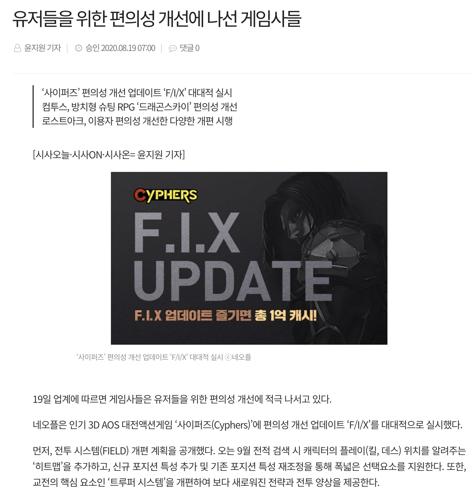
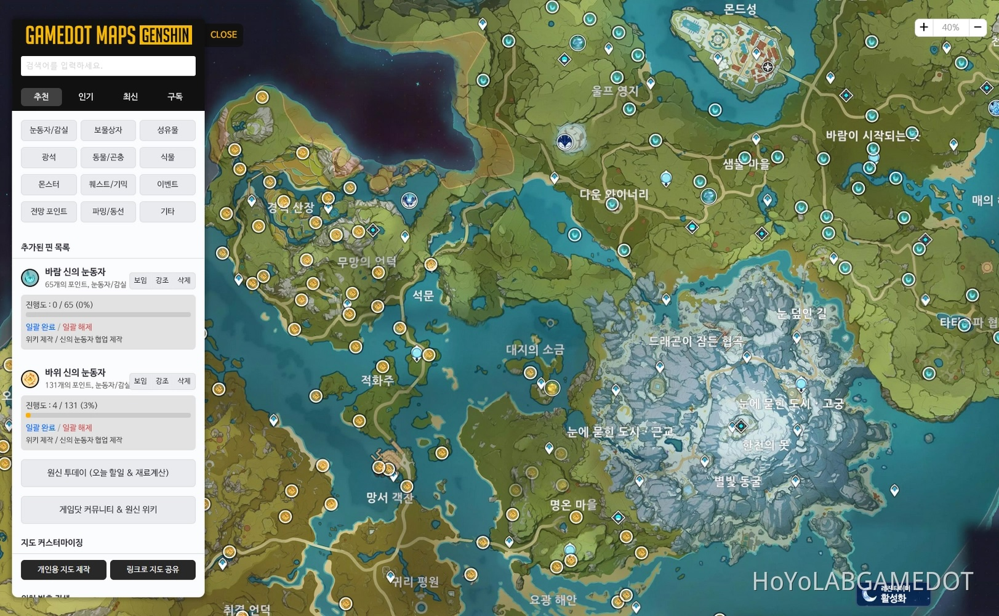
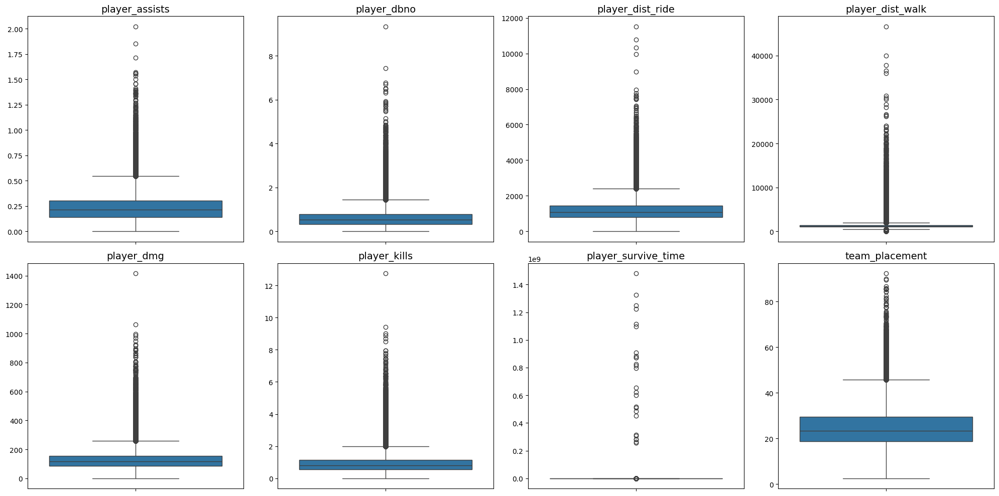
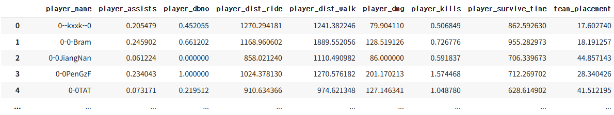
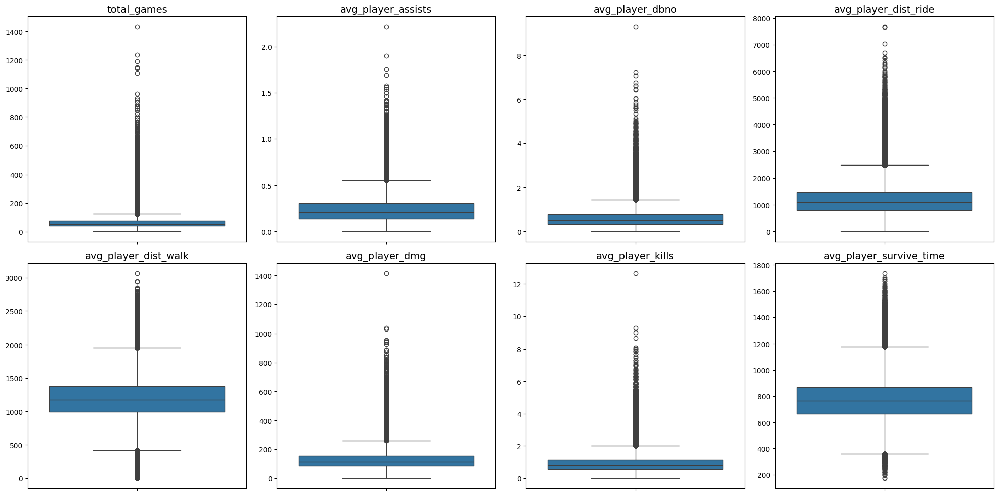
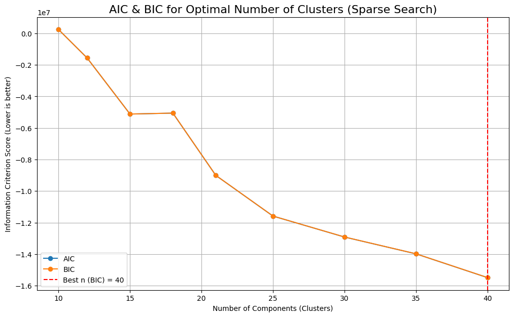
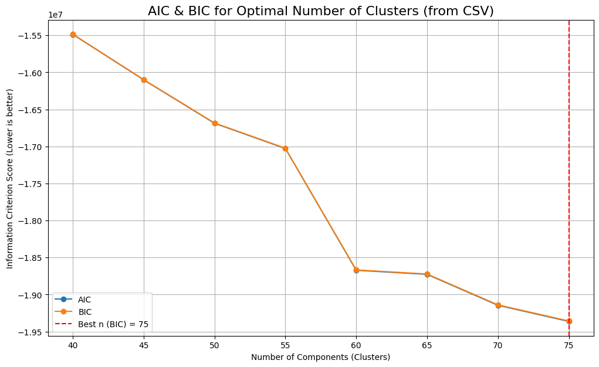
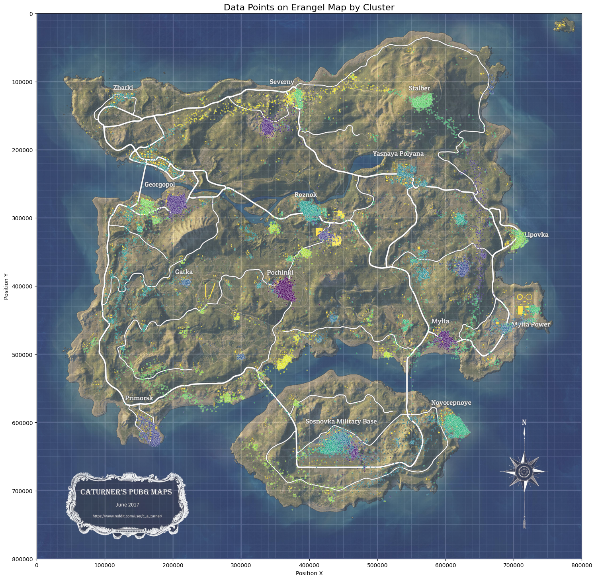

    

# 훈수없음 팀 소개
<table align=center>
  <tbody>
    <tr>
      <td align="center">
        

          
          <a href="https://github.com/souluk319">
김성욱
</a>
        

      </td>
      <td align="center">
        

          
          <a href="https://github.com/Melonmacaron">
신지섭
</a>
        

      </td>
      <td align="center">
        
        <a href="https://github.com/Hawon-Oh">
오하원
</a>
      </td>
      <td align="center">
        
        <a href="https://github.com/sangpiri">
이상혁
</a>
      </td>
      <td align="center">
        
        <a href="https://github.com/myem21">
정종현
</a>
      </td>
    </tr>
  </tbody>
  
</table>

## 목차
1. 프로젝트 개요
2. WBS
3. EDA 및 클러스터링
4. 가설과 입증
5. 프로젝트 로드맵
6. 모델별 결과
7. 결론
8. 트러블 슈팅
9. 회고

###

# 프로젝트 개요

### 프로젝트 소개
> 최종 생존자가 되기 위해 프로젝트에 목마른 배틀그라운드 게임 유저들을 위해, 조기 탈락 확률이 높은 낙하/착륙 지점을 피할 수 있게 '훈수'를 두는 프로젝트 (그러나 팀명은 훈수없음 🤣)

### 프로젝트 배경

    
    

> 최근 게임사들은 신규유저 유입을 위해 많은 노력을 기울이고 있다. 진입장벽을 낮추기 위해 단순한 튜토리얼뿐 아니라 세부적인 전략을 가르쳐 주는 형태나 추가적인 정보를 제공하거나 더 쉽게 조작할 수 있도록 하는 등 많은 연구를 위해 많은 비용을 소비하고 있다. 또한 상대경쟁 게임의 유저는 승부욕이 강한 경우가 많고 자신의 승률과 실력향상을 위해 전적 검색 사이트 등 여러 정보를 획득할 수 있는 웹 서비스를 많이 이용하고 있고 이런 시장 또한 커지고 있다. 허나 대부분의 경우 정보나 통계를 제공할 뿐 사용자에 맞춰 예측을 하여 세부적인 전략 수립에 도움을 주는 경우가 부족했고 이 프로젝트는 이런 문제 인식에서 시작하여 진행하게 되었다.

### 프로젝트 목표
> 실제 유저의 스탯(특징)과 낙하/착륙 위치를 기반으로 각 지역(랜드마크)의 조기 탈락율을 머신러닝을 통해 예측함으로써 유저들이 데이터 기반의 최적의 낙하/착륙 전략을 수립할 수 있게 함으로써, 실력 향상이 되기 전 조기 탈락으로 인해 게임에 흥미를 잃어 게임 이용을 중단하는 게임 이탈률을 방지함

### 데이터 출처
[Pubg Match Deaths Dataset - Kaggle](https://www.kaggle.com/datasets/skihikingkevin/pubg-match-deaths)

###
# WBS
| 날짜                | 담당자                         | 산출물                               |
|-------------------|------------------------------|----------------------------------|
| 9/28 ~ 10/2  | 공통                           | 주제 조사                           |
| 10/2 ~ 10/10  | 신지섭 | 플레이어 데이터 및 랜딩 포인트 클러스터링|
| 10/2 ~ 10/10  | 이상혁, 김성욱, 오하원             | 1차 모델링을 위한 데이터 정제|
| 10/10 ~ 10/13  | 신지섭, 이상혁, 김성욱              | 1차 Landing Zone 적용 모델          |
| 10/11 ~ 10/12  | 신지섭, 정종현                    | 최종 모델링을 위한 데이터 정제|
| 10/13 ~ 10/14  | 신지섭, 이상혁, 김성욱, 오하원    | 최종 모델 학습 및 파라미터 튜닝 |
| 10/13 ~ 10/14  | 신지섭, 김성욱    | 스트림릿 페이지 생성 |
| 10/13 ~ 10/14  | 공통    | 발표 자료 정리 및 결과 도출 |

###
# 기술스택

<h3>Tools

  
  

<h3>ML

  
  
  
  
  
  

<h3>시각화

  
  
  

###
# EDA 및 클러스터링
<b>경기 결과 데이터</b>

|컬럼명                  | 한글명      | 의미 설명                            |
| ----------------------- | ----------- | -------------------------------- |
| **date**                | 경기 날짜       | 경기가 진행된 날짜 및 시간                  |
| **game_size**           | 게임 참가 인원 수  | 한 경기의 총 플레이어 수 (예: 100명)         |
| **match_id**            | 경기 ID       | 각 경기를 구분하는 고유 식별자                |
| **match_mode**          | 경기 모드       | 솔로 / 듀오 / 스쿼드 등 경기 방식            |
| **party_size**          | 파티(팀) 인원 수  | 함께 플레이한 팀원 수 (1=솔로, 2=듀오, 4=스쿼드) |
| **player_assists**      | 어시스트 수      | 적 처치에 기여한 횟수                     |
| **player_dbno**         | 다운(DOWN) 횟수 | 적을 기절시킨 횟수 (최종 킬은 아님)            |
| **player_dist_ride**    | 차량 이동 거리    | 차량으로 이동한 거리 (단위: 미터)             |
| **player_dist_walk**    | 도보 이동 거리    | 걸어서 이동한 거리 (단위: 미터)              |
| **player_dmg**          | 피해량(Damage) | 적에게 가한 총 피해량                     |
| **player_kills**        | 킬 수         | 최종적으로 적을 처치한 횟수                  |
| **player_name**         | 플레이어 이름     | 플레이어의 닉네임 또는 ID                  |
| **player_survive_time** | 생존 시간       | 플레이어가 생존한 총 시간 (초 단위)            |
| **team_id**             | 팀 ID        | 한 경기 내에서 팀을 구분하는 번호              |
| **team_placement**      | 팀 순위        | 경기 종료 시 팀의 최종 순위 (1위=우승)         |

해당 데이터에서 좌표가 0에서 800000이상인 행과 각 스탯이 비정상적인 수치를 가진 경우를 제외후 플레이어 평균 스탯 데이터를 확보

###
<b>킬로그 데이터</b>

| 영어 컬럼명                | 한국어 번역     | 의미 설명                                 |
| --------------------- | ---------- | ------------------------------------- |
| **killed_by**         | 처치 수단      | 킬이 발생한 원인 (무기 이름, 폭발, 낙사 등)           |
| **killer_name**       | 킬한 플레이어 이름 | 상대를 죽인 사람의 닉네임                        |
| **killer_placement**  | 킬러의 순위     | 킬을 한 플레이어의 최종 경기 순위 (1위=우승)           |
| **killer_position_x** | 킬러 위치 X좌표  | 킬 발생 시 킬러의 지도상 X좌표                    |
| **killer_position_y** | 킬러 위치 Y좌표  | 킬 발생 시 킬러의 지도상 Y좌표                    |
| **map**               | 맵 이름       | 경기가 진행된 지도 이름 (예: Erangel, Miramar 등) |
| **match_id**          | 경기 ID      | 해당 킬이 발생한 경기 식별자                      |
| **time**              | 발생 시각      | 킬이 일어난 시점 (단위: 초)                     |
| **victim_name**       | 희생자 이름     | 사망한 플레이어의 닉네임                         |
| **victim_placement**  | 희생자 순위     | 사망한 플레이어의 최종 경기 순위                    |
| **victim_position_x** | 희생자 위치 X좌표 | 사망 시 희생자의 지도상 X좌표                     |
| **victim_position_y** | 희생자 위치 Y좌표 | 사망 시 희생자의 지도상 Y좌표                     |

해당 데이터에서도 0에서 800000이상인 행을 제외후 <i>2분 30초 이전 사망좌표</i> 데이터프레임과 <i>2분 30초 이전 킬을 하고 이후 사망</i> 데이터프레임을 확보

###
<b>클러스터링</b>

    
    

###
# 가설과 입증

  <strong>✔️ 가설 1. "플레이어 스탯은 조기 이탈 여부와 상관관계가 높을 것이다. "</strong>
  

    <strong>- 데이터 수집:</strong> 플레이어의 스탯과 생존시간을 추출 
    <strong>- 데이터 분석:</strong> 스탯과 상관관계 분석시에 hitmap상에서 연관도가 낮게 관측되었다. 
    <strong>- 결과 해석:</strong> 스탯은 분명 중요한 영향을 미칠 것으로 예상되나 추출한 데이터에 노이즈가 많고 플레이어의 성향을 표현하기에는 특징이 부족한 것으로 보임 
    <strong>- 결과:</strong> <i>현재 가지고 있는 스탯 정보를 통해 완벽하게 플레이 성향을 분석하기에는 어려움이 존재</i> 
  

###

  <strong>✔️ 가설 2. "교전이 많이 일어나는 지역일수록 사망확률이 높을 것이다. "</strong>
  

    <strong>- 데이터 수집:</strong> 조기이탈 (3분)내에 죽은 케이스를 지도상에 데이터 포인트로 지정후 클러스터링 
    <strong>- 데이터 분석:</strong> 대부분 클러스터링 된 데이터 포인트들이 실제 지도에 표시된 대도시 주변에 분포 
    <strong>- 결과 해석:</strong> 랜딩 클러스터가 사망률에 영향이 크게 나타나는 것으로 보임 
    <strong>- 결과:</strong> <i>예측 가능</i> 
  

###

  <strong>✔️ 가설 3. "플레이어 스탯과 7분 이내 발견된 위치를 통해 착륙지점 예측이 가능할 것이다."</strong>
  

    <strong>- 데이터 수집:</strong> 배틀그라운드 데이터 셋에 킬 로그 
    <strong>- 데이터 분석:</strong> 150초 안에 킬을하여 위치가 특정된 사람이 그 이후에 죽은 경우를 찾아서 사용 
    <strong>- 결과 해석:</strong> 대부분의 경우 두 위치가 너무 멀지 않고 특수하게 행동하는 몇 가지 케이스를 제외하면 연관성이 있음 
    <strong>- 결과:</strong> <i>예측 가능</i> 
  

### 
# 프로젝트 로드맵
1.  **사용할 플레이어 데이터 생성**
    * 72만개의 매치 데이터에서 400만명의 유저중 40판 이상 플레이한 유저들 30만명을 추출
    * 해당 플레이어의 평균 스탯을 추출
2.  **랜딩 포인트 클러스터링**
    * 2분 30초(위치가 크게 변하지 않았을 것으로 예상되는 시간) 이내에 죽은 사람들을 지도상에 X,Y좌표로 데이터 포인트화
    * GMM을 통해 39개의 랜딩 포인트로 클러스터링
3.  **사망 위치와 사망 시간을 통한 랜딩 포인트 예측 모델 학습**
    * 원본 데이터에 사망률과 상관관계가 높다고 예상된 랜딩포인트에 대한 데이터의 부재
    * 사망한 시간이 지나치게 크지 않다면 최초 랜딩위치를 추정할 수 있을 것으로 가정
    * 2분 30초 전에 킬을 하여 초기 위치가 특정된 플레이어가 이후에 죽은 위치를 특징으로 킬을 한 초기 위치가 속한 클러스터를 예측하는 모델 생성
    * 이 모델을 통해 2분 30초 이전에 킬을 한적이 없지만 너무 늦지 않은 시간 이전에 죽은 사람들의 랜딩포인트를 추정데이터로 대체
4.  **플레이어 스탯 + 랜딩 포인트를 통해 조기 이탈 예측 모델 학습**
    * XGBoost, LightGBM, DMLP의 모델로 학습을 진행
5.  **모델을 통한 유저에 맞는 예측 통계 제공**
    * 학습한 모델을 통해 유저에게 정보를 입력받고 해당 유저가 원하는 위치에 랜딩했을때나 주요 도시에서의 사망률을 표시

# **모델별 결과**
* 1차 모델 (랜딩 포인트 예측 모델)
<table>
  <tr>
    <th>Model Name</th>
    <th>Accuracy</th>
    <th>Precision</th>
    <th>Recall</th>
    <th>F1 Score</th>
    <th>Hyper parameters</th>
  </tr>
  <tr>
    <th scope="row" style="text-align:left;">XGBoost</th>
    <td>0.9202</td><td>0.9154</td><td>0.9202</td><td>0.9168</td>
    <td>n_estimators: 105,  max_depth: 8,  learning_rate: 0.07</td>
  </tr>
    <tr>
    <th scope="row" style="text-align:left;">MLP</th>
    <td style="border-bottom: 1px solid gray; padding: 5px;">0.90</td>
    <td style="border-bottom: 1px solid gray; padding: 5px;">0.91</td>
    <td style="border-bottom: 1px solid gray; padding: 5px;">0.90</td>
    <td style="border-bottom: 1px solid gray; padding: 5px;">0.90</td>
    <td style="border-bottom: 1px solid gray; padding: 5px;">128->64의 2개의 은닉층,  배치 정규화 적용, 부족클래스 가중치 적용, 드롭아웃 0.3 적용</td>
  </tr>
</table>

###
* 최종 모델 (플레이어 스탯 + 내린위치로 사망여부 예측)
<table>
  <tr>
    <th>Model Name</th>
    <th>Accuracy</th>
    <th>Precision</th>
    <th>Recall</th>
    <th>F1 Score</th>
    <th>Hyper parameters</th>
  </tr>
  <tr>
    <th scope="row" style="text-align:left;">XGBoost</th>
    <td>0.67</td><td>0.61</td><td>0.6</td><td>0.6</td>
    <td>n_estimators: 759,  max_depth: 10,  learning_rate: 0.012</td>
  </tr>
  <tr>
    <th scope="row" style="text-align:left;">LightGBM</th>
    <td>0.63</td><td>0.64</td><td>0.51</td><td>0.52</td>
    <td>metric: auc,
      learning_rate: 0.01,
      num_leaves: 50,
      max_depth: 5,
      feature_fraction: 0.7,
      bagging_fraction: 0.7,
      bagging_freq: 5</td>
  </tr>
    <tr>
    <th scope="row" style="text-align:left;">MLP</th>
    <td style="border-bottom: 1px solid gray; padding: 5px;">0.60</td>
    <td style="border-bottom: 1px solid gray; padding: 5px;"></td>
    <td style="border-bottom: 1px solid gray; padding: 5px;"></td>
    <td style="border-bottom: 1px solid gray; padding: 5px;">0.5448</td>
    <td style="border-bottom: 1px solid gray; padding: 5px;">128->64의 2개의 은닉층,  배치 정규화 적용, 부족클래스 가중치 적용 드롭아웃 0.4 적용</td>
  </tr>
</table>

클래스 불균형으로 인한 조화 평균을 고려하여 F1-Score를 주요 평가 지표로 사용 0.6으로 가장 높은 성능을 보이고 1(조기사망)에 대해서 비교적 균등한 값을 보여준  XGBoost 모델을 사용하기로 결정

###
# **결론 및 향후 개선 방안**
핵심 발견 및 한계점 진단
현재 모델로 예측한 결과, **랜딩 포인트(Landing Point)**가 플레이어의 조기 이탈(Early Exit) 여부에 가장 큰 영향을 미치는 요인임을 확인했습니다. 하지만 최종 모델의 예측 성능이 기대치에 미치지 못했으며, 이에 대한 주요 원인을 다음과 같이 분석했습니다.

플레이어 스탯 데이터의 표현력 부족:

초기 **탐색적 데이터 분석(EDA)**에서 중요할 것으로 예상했던 플레이어 스탯 데이터가 실제 모델에 크게 반영되지 못했습니다.

이는 해당 스탯 데이터가 플레이어의 고유한 성향이나 전략을 온전히 담아내지 못하는 표현력의 한계를 가졌기 때문인 것으로 추측됩니다.

게임 내 무작위 요소(Randomness) 미고려:

배틀그라운드의 비행기 경로, 자기장 패턴 등과 같은 주요 무작위 요소들이 데이터셋에 포함되지 않아 모델이 이를 학습하지 못했습니다.

당초 영향력이 작을 것으로 판단했던 이 무작위 요소들이 실제로는 플레이어의 조기 이탈에 상당한 영향을 미쳤을 가능성이 높습니다.
---
개선 방향 및 전략
결론적으로, 플레이어의 조기 이탈은 예상대로 랜딩 포인트와 밀접한 관계를 보였으나, 보유한 데이터의 표현력 부족으로 인해 모델 성능의 **명확한 한계점(Bottleneck)**에 도달했습니다.

향후 모델 성능을 개선하기 위해, 킬로그 데이터에서 매치별 사망 시각 및 분포를 해석하여 무작위 요소의 패턴을 정형화하고, 이를 **'매치의 특징'**으로 추가하는 방안을 고려했습니다. 이러한 추가 요소를 학습 데이터에 포함한다면 현재 성능 한계를 일정 부분 돌파할 수 있을 것으로 판단됩니다.

###
# 트러블 슈팅
1. 대용량 데이터에 따른 문제점
    - 문제점 : 대용량 데이터는 전처리 부터 쉽지 않았다. 약 6500만개의 데이터를 5개의 csv파일로 쪼개놓았었기 때문에 해당 데이터를 램으로 한번 불러오는데 3분정도 소요되었으며 Colab을 이용했을때에는 작은 램 용량으로 세션이 다운되는 일이 잦았다.
    - 해결방법 : CPU를 사용하는 부분은 코랩보다 램 용량을 자유롭게 키울 수 있는 GCP환경에서 데이터를 전처리하고 학습시켰다. 또한 Polars를 활용하여 처리 속도를 높일 수 있었으며 Python의 gc를 이용해 더이상 필요없는 데이터를 램에서 삭제하면서 프로젝트를 진행하였다.
    - 남은 문제점 : 사용하거나 생성한 대부분의 데이터프레임이 작게는 100MB에서 20GB까지 크기가 커서 깃허브에 제대로 푸쉬가 되지 않는 부분이 존재했다. 일부 파일은 lfs를 통해 해결했지만 그럼에도 너무 큰 파일은 링크를 첨부하는 형태로 전송하였다.
  
2. 클러스터링 클러스터 개수 선정
    - 문제점 : 랜딩 위치를 묶는 클러스터링 과정에서 몇개가 최적의 클러스터 개수일지가 미지수였다. 너무 큰 클러스터는 램에 담기지 않아 세션이 종료되거나 학습이 불가능 했다.
    - 해결방법 : 클러스터의 개수를 2에서 100까지 점진적으로 늘려보며 AIC와 BIC를 이용하여 적절한 수치를 탐색했다. 램이 부족한 경우는 위와 마찬가지로 GCP환경에서 구동하여 약 70GB의 램을 이용하여 학습시킬 수 있었다.
  
3. 최종모델 데이터 불균형 문제
    - 문제점 : 최종 모델에서 데이터 불균형으로 인해 Accuracy는 높고 F1-Score는 낮은 형태의 모델만 학습되었고 생각보다 플레이어 스탯지표가 최종 Target예측에 상관관계가 약해서 잘 분류되지 않는 경향이 있었다.
    - 해결방법 : 모델의 하이퍼 파라미터 튜닝과 모델의 구조 변경등의 여러 방법을 시도하여 무작위 선택 보다는 높은 수치인 아주 높지는 않지만 적절한 성능을 가진 XGBoost 모델을 선택하였다.

# 회고
- **김성욱:** 프로젝트 주제를 결정하는 과정이 좋았다.
자발적 참여를 서로 독려하는 취지로 모두 빠짐없이 아이디어를 제출 했고 가장 많은 지지를 얻는 주제가 선정되었다.
계획이 뚜렷했던 모팀원이 특히 많이 수고 해주었고, 내가 적어놓았던 질문들을 늘 먼저 질문 해주었던 배려심 좋은 또 다른 팀원 덕에
각자 맡은바에 책임을 다할 수 있었고, 존중하며 훈수 없이 서로 잘 이끌어주었다.
팀의 입장에서 아쉬운점이라면 팀원들의 스케쥴이 제각각이였던 부분이였고, 스스로에게 아쉬운점이라면 모델을 빌드하는 부분에 있어서 정확히 알고 하는 부분이 적었던 부분, 여러모로 복습의 필요성을 또 한번 다짐하게 되었다.
자발적 참여를 서로 독려하는 취지로 모두 빠짐없이 아이디어를 제출 했고 가장 많은 지지를 얻는 주제가 선정되었다.
계획이 뚜렷했던 모팀원이 특히 많이 수고 해주었고, 내가 적어놓았던 질문들을 늘 먼저 질문 해주었던 배려심 좋은 또 다른 팀원 덕에
각자 맡은바에 책임을 다할 수 있었고, 존중하며 훈수 없이 서로 잘 이끌어주었다.
팀의 입장에서 아쉬운점이라면 팀원들의 스케쥴이 제각각이였던 부분이였고, 스스로에게 아쉬운점이라면 모델을 빌드하는 부분에 있어서 정확히 알고 하는 부분이 적었던 부분, 여러모로 복습의 필요성을 또 한번 다짐하게 되었다.
- **신지섭:** 이번 프로젝트에서 전체적인 흐름 설계와 플레이어 데이터 추출, 클러스터링, 1차 예측 모델 제작을 주로 맡았습니다. 대용량 데이터를 다룰때 어려웠던 점이 GPU가 아니라 RAM용량에 부족이 더 크게 느껴졌었고 GCP와 같은 클라우드 컴퓨팅 서비스를 통해 이를 해결하였습니다. 최종모델의 아쉬움에서 앞으로의 프로젝트에서는  EDA과정이 좀 더 치밀하게 기획되어야 한다는 점을 깨달았습니다.
- **오하원:** 배틀그라운드라는 게임 자체에 대한 이해도가 있어야만 데이터포인트가 왜 이런지, 이 지점의 클러스터는 왜 이런지 등 제대로 된 해석이 가능했습니다. 아는 게임조차 실제 데이터를 다루다보며 애먹을 점이 있었습니다. 만약 잘 모르는 분야의 데이터를 다룬다면 통계적 오류를 줄이고자 실무자와의 대화가 중요하겠다 느꼈습니다.
- **이상혁:** 대용량 데이터를 모델링하는 과정에서 시간이 많이 걸려 애를 먹었다. raw data에 착륙 위치에 해당하는 특징 컬럼이 없어, 그것을 1차 모델링을 통해 도출한 후 그렇게 추정된 착륙 위치를 통해 조기 탈락 여부를 예측하는 2차 모델링을 진행하는 2번의 연결된 논리 구조가 복잡해 구조도를 파악하려고 노력했다. 그리고, 깃을 통째로 날려버리는 대형 실수를 저질러서 팀원에게 매우 미안했다. 다행히 클론해둔 자료가 있어 복구할 수 있었지만, 바쁜 팀원에게 추가적으로 부담을 줘서 죄송할 따름이다. 깃 사용이 너무 어려운데 사용 실력이 늘었으면 좋겠다.
- **정종현:** 잘 모르지만 유명한 게임(베틀그라운드)의 새로운 시각(신 장르 게임과 하는 방법)과 Data의 의미를 알기 어려웠기에 
모델의 적용과 검증 방향을 전혀 못잡아 팀에 전혀 도움이 못되었습니다. 
이후 Data의 의미를 알수 있도록 사용자의 입장에서 좀더 Data의 분석을 하도록 하겠습니다. 

